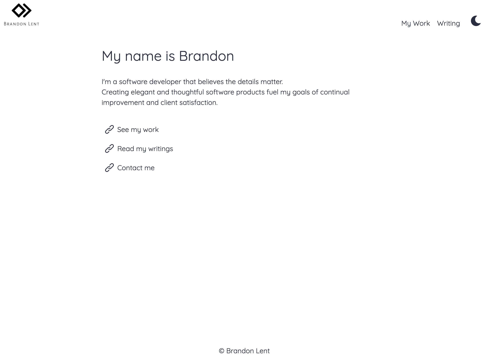
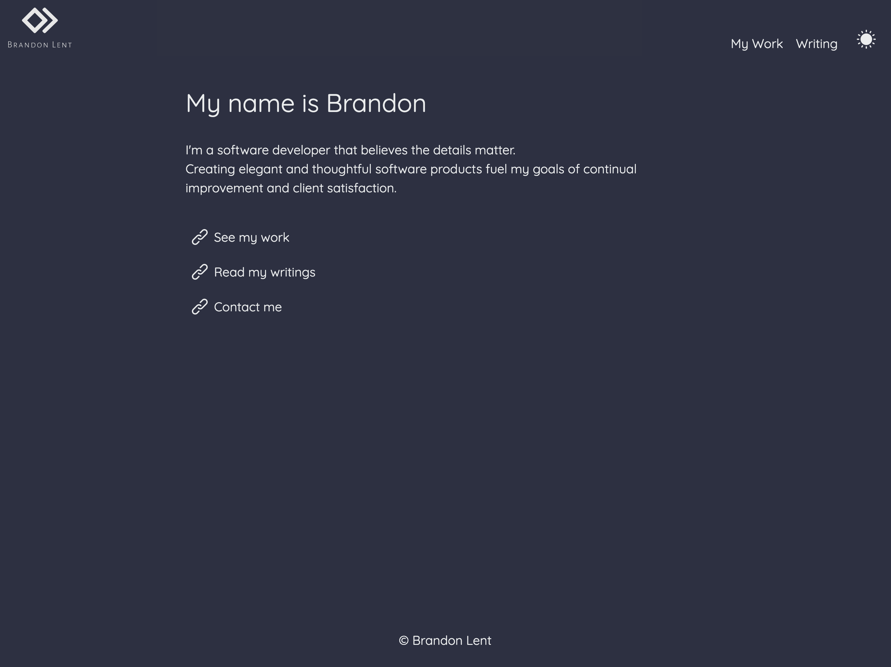
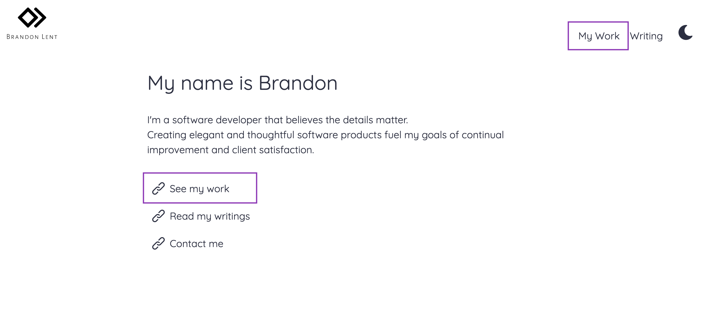
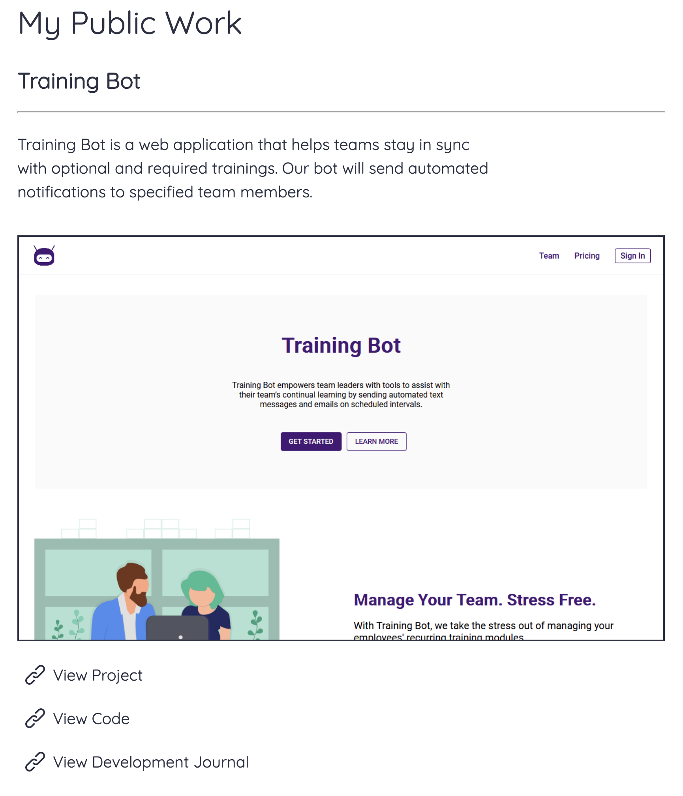

# Portfolio

At the beginning of 2020, I decided to redesign my portfolio from the ground-up. Previously, I used an HTML template that served static HTML.

I have three goals I want to accomplish with this project:

1. To serve as a reference to my best work.
2. To have a robust, custom writing management system I can post future articles on.
3. To test new technological implementations.

---

## 1. Displaying My Work

An important aspect of my portfolio is to display my work to potential clients/employers. I created this website with the intentions of being easy to use and find my best work.

### How I Solved This Problem

#### Custom Component Library

I created a custom component library for this project (and potential future projects!).
This library allows me to do two things:

- Easily reuse common components across the application.
- Allow for project-wide style definitions.

This is what allowed me to easily implement dark-mode into the application as seen below:

##### Light Mode

##### Dark Mode

---

#### Straight-Forward Navigation

Once a user navigates to the landing page, they have two ways to access my work:

##### Easily Find My Work

#### Display What Matters

I believe that keeping things simple, is typically the best choice in most scenarios. I utilized this belief when designing the `My Work` page.

I only want to display what is most relevant and allows the user to easily learn more about a specific project.

##### Project From My Work

Two key aspects of this user interface are:

- Allowing users to view the project by clicking either the image or the `View Project` link.
- Allowing users to find more information about the project by clicking on `View Code` or `View Development Journal`

---

## 2. Robust Content Management System

This feature is currently in progress. I will update this as I build out the feature more.

## 3. Testing New Technology

Creating a project that I am maintaining myself allows me to make all design decisions. This allows me to test technology that I have not used before, such as TypeScript.

Some key technologies and implementations that I follow are:

- Using TypeScript to type check my code as well as follow a consistent code style.
- Using SCSS and utilizing mixins and variables that are coupled to components, which allow me to style and theme components quickly and effieciently(I typically used `Styled Components` on most of my projects).

I may also add new technologies or styling guidelines to my project in the future, particularly when I start implementation of my Robust Content Management System.
